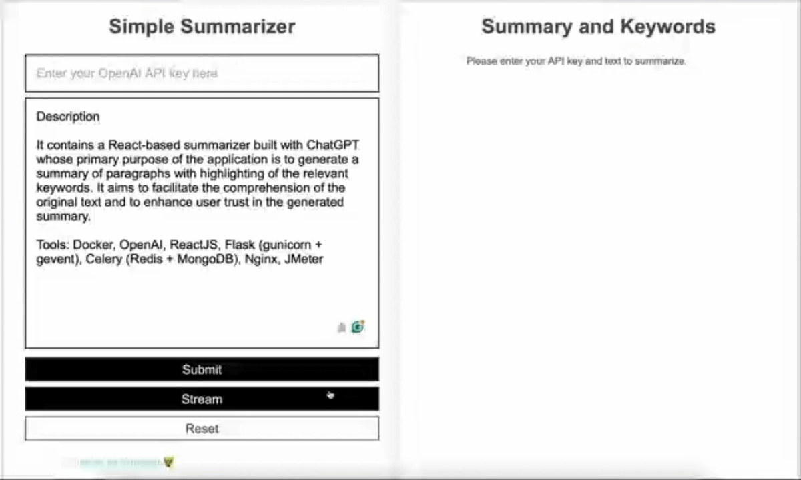

<h1 align="center">
    React-ChatGPT
</h1>

    <strong>Simple Full-Stack Summarizer based on ChatGPT</strong>

## Simple Summarizer
### Description

    It contains a React-based summarizer built with ChatGPT whose primary purpose of the application is to generate a summary of paragraphs with highlighting of the relevant keywords. It aims to facilitate the comprehension of the original text and to enhance user trust in the generated summary. I also make efforts in protecting the personally identifiable information (PII) with Presidio.

    <b>Tools</b>: <em>Docker, OpenAI, Presidio, ReactJS, Flask (gunicorn + gevent), Celery (Redis + MongoDB), Nginx, JMeter</em>

    

---
For different usages:
- [Frontend only](https://github.com/frankling2020/react-chatgpt/tree/14e64d47605a96d34d01939ab11d60963376b61c)
- [Frontend and Backend (Flask)](https://github.com/frankling2020/react-chatgpt/tree/b8ece92e1ebb819aebf366dc9cc071d71228df7b)
- [Celery and Redis](https://github.com/frankling2020/react-chatgpt/tree/e30dd17f802e963a2e452c967c0406d3aec473d5)
- [Nginx](https://github.com/frankling2020/react-chatgpt/tree/3b98a98b7d3f1cf3ba7f8c938d1736e54481aa91)
- [With JMeter](https://github.com/frankling2020/react-chatgpt/tree/905091edf532f926ed0952012500cb817f24f204)
- [Streaming with Flask and Nginx](https://github.com/frankling2020/react-chatgpt/tree/be07e23d79e4aa251ff89daf456f57dceafa9a93): further implementation will be done with Redis Stream.
- [PII Protection with Presidio under normal submit](): further implementation will be done to the streaming version.

---
#### Why Tools?
- **Docker**: Docker is widely used for deploying web applications. Many cloud providers, such as AWS, Google Cloud, and Azure, have native support and integration with Docker, making it easier to deploy and manage containerized applications in their environments. Besides, Docker has a more mature set of tooling and orchestration solutions, such as Docker Compose, Docker Swarm, and integrations with Kubernetes. These tools simplify the management and scaling of containerized applications.
- **Microsoft Presidio**: Presidio is the most suitable choice when no labeled data is available.
  - Details: Presidio is rule-based, offering high configurability and multi-language support but limited to predefined patterns. BertPII leverages transformer models for contextual understanding but requires labeled data. OpenNLP provides machine-learning-based entity extraction models with decent accuracy. SpaCy combines rules, statistics, and neural networks, balancing performance and extensibility. The trade-off depends on the application's complexity, language requirements, available training data, and desired level of model interpretability versus performance.
- **ReactJS**: React is a popular choice for building modern web application frontends. React's component-based architecture promotes modularity, reusability, and encapsulation of UI elements. This makes it easier to build and maintain complex user interfaces by breaking them down into smaller, self-contained components.
- **Flask**: Flask is a lightweight and flexible Python web framework that is easy to learn and get started with.
- **Gunicorn**: Gunicorn (Green Unicorn) is a widely used Python WSGI HTTP server that is designed to handle multiple concurrent requests efficiently. Gunicorn supports various worker models, including asynchronous workers, which can improve the performance of Flask applications.
- **Gevent**: it will allow web application to scale to potentially thousands of concurrent requests on a single process. It mainly replaces blocking parts with compatible cooperative counterparts from gevent package by "monkey patching". It uses epoll or kqueue or libevent for highly scalable non-blocking I/O.
- **Celery**: Celery is a powerful and robust distributed task queue system that enables asynchronous task execution, scheduling, and distributed work processing. Celery supports distributing tasks across multiple workers, allowing applications to scale horizontally by adding more Celery workers as needed.
- **Redis**: Redis provides a fast, lightweight, and efficient message queue system, making it suitable for handling large volumes of tasks and ensuring reliable task delivery.
- **MongoDB**: Using MongoDB as the backend along with Redis as the message broker for Celery can provide a powerful and scalable solution for asynchronous task processing in web applications. While Redis is an excellent message broker, it is not designed for persistent storage of complex data structures like task results. MongoDB, on the other hand, provides a durable and scalable solution for storing task results, metadata, and other related information.
- **Nginx**: NGINX is well known as a high‑performance load balancer, cache, and web server. It is often preferred over Linux Virtual Server (LVS) for load balancing and reverse proxying. It is a full-featured web server and reverse proxy, providing a complete solution with built-in load balancing, caching, access control, and other features. LVS, on the other hand, is primarily focused on load balancing and requires additional components for other functionalities.
- **JMeter**:  JMeter is a popular open-source tool used for load testing and performance testing of web applications, among other types of applications. JMeter generates detailed reports and graphs that help analyze the test results, including response times, throughput, and resource utilization. This information is valuable for identifying bottlenecks and optimizing the application's performance.

---

### Code Design and Explanation

    The source code for the summarizer can be found in the <em>src</em> folder, which contains all the primary implementation files. It contains the components including Form and Histogram in <em>src/components</em> and the main file <em>App.js</em>. The application leverages several techniques to achieve its objectives, including Jaccard similarity and a histogram of word length frequency, which respectively delineate the connection to the original text and comprehensibility.

#### Justification
- Jaccard similarity is widely used to compute the similarity of two set. In this case, I calculate it with respect to keywords.
- Word length frequency can somehow reflect the frequency of rare words and [one paper](https://arxiv.org/abs/2301.11305v1) also shows that there are some statistical patterns in machine-generated texts. 
    Word length may be one way to approach the ChatGPT detection. It will be meaningful to visualize the distribution.
- Anonymization is a critical issue in the summarization task. I use Presidio to protect the PII information in the text. It is a good practice to protect the privacy of the users. Redis will help to store the PII information in the cache with hash keys. The input rephrasing will be done with the help of Presidio. The idea is inspired by the [Microsoft Presidio](https://microsoft.github.io/presidio/) project and the paper [Can Sensitive Information Be Deleted From LLMs? Objectives for Defending Against Extraction Attacks](https://arxiv.org/abs/2309.17410). You can see the sample below without mapping the PII information to the original text.

    

#### <strong>Basic rules</strong> are:
- If the Jaccard similarity is lower than 0.7, you may doubt the results.
- If the length of most words are shorter, then it will be easy to read.

    For the web interface part, the public folder contains some basic information.

    

### Deployment

Please see the deployment of pure ReactJS <a href="https://frankling2020.github.io/react-chatgpt/">here</a>. You can see the original code in the other branch. 
 

This repository contains the code for Docker deployment with Flask, ReactJS, Celery, and Gunicorn.

---

### Development
#### Frontend: ReactJS
You can follow the steps below one-by-one
- `npm install`: first install the dependencies for the project.
- `npm run start`: see your version of the application after you change some codes.
- `npm run deploy`: deploy the application after checking [this link](https://facebook.github.io/create-react-app/docs/deployment).

#### Backend: Flask + Gunicorn
You should also run the Flask backend at the same time which is held at localhost:5000. You can start it by running either of the following commands.
- `python3 server.py`
- `gunicorn server:app -c ./gunicorn.conf.py` (preferred)

You may want to take a deep look at the configuration file `backend/gunicorn.conf.py` to adapt to your environment.

#### Broker: Celery + Redis
You can start the broker to make the web appliaction more scalable with the command
- `celery -A celery_task worker --loglevel=info`

The detailed configuration is under `backend/celeryconfig.py`

#### Load Balance: Nginx (TO-DO)
Please see the configuration in `nginx.conf`. Run with
- `nginx -g daemon off`

**Comment**: Currently, I am not familiar with the high-level Nginx operations.

#### JMeter (Simple test: TO-DO)
- See the files under `jmeter-tests`. In the figure below, Docker Desktop plug-in `qainsights/jmeter` with JMeter is used. In the test, I set the test with `time.sleep(2)` to complete the work.

    

**Configuration**:
- Image: qainsights/jmeter:latest
- Volume: react-chatgpt/jmeter-tests:/jmeter-tests
- Test plan: /jmeter-tests/web-test-plan.jmx
- Proxy: host.docker.internal:8001
- Logs: /jmeter-tests/run.log
- Run.log: /jmeter-tests/result.jtl

**Comment**: Currently, I am trying to understand the concepts. Here is a just simple test demo.

#### Development with Docker
Docker is a good tool to deploy applications in different platforms. Here you can see we have `Dockerfile` in both `frontend/` and `backend/` folders and `docker-compose.yaml` in the directory. So, you can directly use the command `docker-compose -d up` with `docker` installed in your computer. I would recommend you to use Docker Desktop which can inspect the containers with GUI shown below.

    
    

We can choose either Node or Nginx as the web server. The top figure is with Node, while the bottom figure is with Nginx. It is worth noticing that with Nginx, the frontend server with Node only need to complete the compilation.

The following figure shows the success deployment and some console log for your debegging in the web inspection mode.

    

### Usage

    It is designed to be user-friendly and easily accessible to users with different technical backgrounds. To use the application, users may first follow the <a href="https://platform.openai.com/account/api-keys">link</a> on the first page to fetch their OpenAI API key which will be memorized before pressing the reset button, and paste the text to the form. After submitting the form, the original text will be rendered on the left side of the window, people may read some when they are waiting for the results from ChatGPT. After receiving the ChatGPT response, the browser will directly highlight the keywords in the original text and summary and compute the Jaccard similarity with respect to the keywords' appearance in the original text and summary.

    For people who know nothing about Jaccard similarity, the basic rule is that the result with Jaccard similarity below 0.7 may include some extra/fabricated information.

    

### Further Discussion

    Overall, this summarizer provides a simple, yet effective way to quickly comprehend a paper's content and ascertain the trustworthiness of the generated summary. It may be used to annotate some machine-generated text with fabricated information for natural language processing research. It is also fun for people to observe how the input text may influence the trustability of ChatGPT, namely whether ChatGPT adds extra/fabricated information to the summary. It also shows how ChatGPT will weigh context information over pre-acquired knowledge.

    

### References
- [react-graph-gallery histogram](https://www.react-graph-gallery.com/histogram)
- [MDN react](https://developer.mozilla.org/en-US/docs/Learn/Tools_and_testing/Client-side_JavaScript_frameworks/React_components#defining_our_first_component)
- [Gunicorn with Flask](https://flask.palletsprojects.com/en/2.3.x/deploying/gunicorn/)
- [Flask with Celery](https://flask.palletsprojects.com/en/2.3.x/patterns/celery/)
- [Nginx: Beginner's Guide](https://nginx.org/en/docs/beginners_guide.html)
- [Presidio: Pseudonymization of PII data](https://github.com/microsoft/presidio/blob/main/docs/samples/python/pseudonomyzation.ipynb)

## Getting Started with Create React App (Default React Documentation)

This project was bootstrapped with [Create React App](https://github.com/facebook/create-react-app).

### Available Scripts

In the project directory, you can run:

#### `npm start`

Runs the app in the development mode.\
Open [http://localhost:3000](http://localhost:3000) to view it in your browser.

The page will reload when you make changes.\
You may also see any lint errors in the console.

#### `npm test`

Launches the test runner in the interactive watch mode.\
See the section about [running tests](https://facebook.github.io/create-react-app/docs/running-tests) for more information.

#### `npm run build`

Builds the app for production to the `build` folder.\
It correctly bundles React in production mode and optimizes the build for the best performance.

The build is minified and the filenames include the hashes.\
Your app is ready to be deployed!

See the section about [deployment](https://facebook.github.io/create-react-app/docs/deployment) for more information.

#### `npm run eject`

**Note: this is a one-way operation. Once you `eject`, you can't go back!**

If you aren't satisfied with the build tool and configuration choices, you can `eject` at any time. This command will remove the single build dependency from your project.

Instead, it will copy all the configuration files and the transitive dependencies (webpack, Babel, ESLint, etc) right into your project so you have full control over them. All of the commands except `eject` will still work, but they will point to the copied scripts so you can tweak them. At this point you're on your own.

You don't have to ever use `eject`. The curated feature set is suitable for small and middle deployments, and you shouldn't feel obligated to use this feature. However we understand that this tool wouldn't be useful if you couldn't customize it when you are ready for it.
