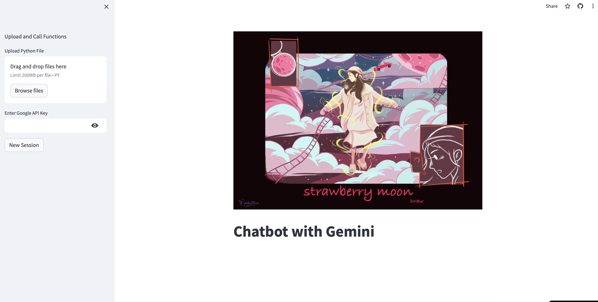

### Simple Streamlit App with Gemini-Pro and Spotify

It provides idea for creating new songs.

- [x] Support Python function loading
- [x] Support audio and figure as inputs 
- [x] Support audio and figure display
- [x] Support markdown display and copy to clipboard
- [x] Incorporate with Spotify API

Simple demo: https://frankling2020-gemini-music-creator.streamlit.app
